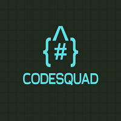

<p align="center">
  
</p>

# CodeSquad
Team CodeSquad’s official repository for the AmBITion 2025 Hackathon.

# MedSafe

Official repository for our project 'MedSafe' developed during **AmBITion Hackathon 2025**.

## About the Project
MedSafe is an AI-powered tool designed to prevent harmful interactions between conventional medicines and Ayurvedic/herbal remedies. Many people take multiple medications or combine modern drugs with traditional treatments without knowing the potential risks, which can lead to serious health complications. Our system allows users to input any combination of conventional drugs and Ayurvedic/herbal medicines and instantly checks for known dangerous interactions. It highlights the severity, warns users of potential risks, and suggests safer alternatives when available. 

## Team
- Rohit Kattimani  
- Savinaya KS  
- Ravindra Sharma  
- Moomin Khan  

## Features
- Drug & Herb Interaction Checker – Input multiple conventional drugs and Ayurvedic/herbal remedies to instantly detect potentially harmful interactions. (Can be expanded to later using IMPPAT dataset)
- Severity Assessment – Categorizes interactions into mild, moderate, or severe, helping users prioritize critical warnings.
- Safer Alternatives & Recommendations – Suggests safer medication options or precautionary steps when risky combinations are detected. (To be worked on)
- User-Friendly Interface – Simple input via drug/herb names (brand or generic) with intuitive color-coded warnings.

## Tech Stack
- Language/Framework: Python (for AI/ML and backend logic)
- Framework/Library: Gradio for interactive web app
- Tools/APIs:
-> DrugBank / ChEMBL (for conventional drug data)
-> PHYDGI / scientific literature datasets (for Ayurvedic/herbal interactions)
-> Pandas / NumPy (data processing)
-> Scikit-learn / XGBoost (for any ML-based prediction or risk scoring)  

## Setup Instructions
```bash
# Clone the repo
git clone https://github.com/RohitKattimani/CodeSquad.git

# Navigate into the directory
cd CodeSquad

# Prepare your Dataset
Either download selected datasets from my Kaggle(https://www.kaggle.com/rokacoding/datasets) or directly download the dataset from HODDI drug-drug action dataset

#Train the model
In the model.py just place the locations of your dataset and then
python model.py

#Run from Gradio
Run the gradioapp.py and open the localhost http://127.0.0.1:7860/
